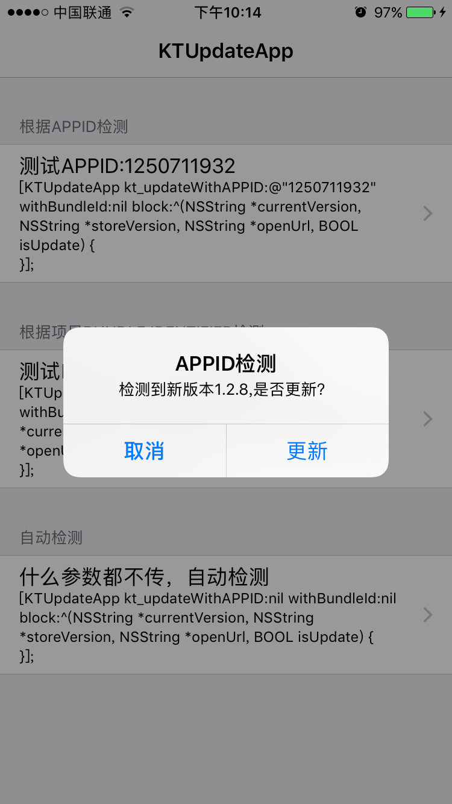

# KTUpdateApp

***
基于天朝的AppStore检测自动更新功能，现已适配iOS11

最好在真机上运行才能看到完全效果哦




***
实现思路

1.本地检测项目版本号；

2.联网检测项目在AppStore上的版本号；

3.比较版本号，可选提供跳转到手机自带的AppStore项目页面供用户下载的地址；
***
文件小巧，轻便：

支持cocoapods：

```
pod 'KTUpdateApp'
```

具体用法：


```
#import "KTUpdateApp.h"
```

```
/**
   一行代码实现检测app是否为最新版本。appId，bundelId，随便传一个 或者都传nil 即可实现检测。

  @param currentVersion 返回当前版本号
  @param storeVersion 返回商店版本号
  @param openUrl 跳转到商店下载的链接
  @param isUpdate 是否需要更新
  @return 
*/
 [KTUpdateApp kt_updateWithAPPID:nil withBundleId:nil block:^(NSString *currentVersion, NSString *storeVersion, NSString *openUrl, BOOL isUpdate) {
  }];
```


***
问题1：这样审核能通过？

答1：亲测能通过，没问题的。
***
问题2：我项目APP ID 在哪里看？

答2：[itunes connect](https://itunesconnect.apple.com/) 》我的APP》APP ID
***
问题3：假如我的项目还没上线，也没有APP ID 怎么搞？

--直接利用自动检测，appId和bundelId都传nil即可。

--或者去 [itunes connect](https://itunesconnect.apple.com/)  申请一个APP，就会有对应的APP ID。

--如果你连开发者账号都没有，那就先用demo里面的APP ID 测试吧，上线的时候改过来即可。

***
### 接下来的更新都会在我的博文中列出来，欢迎关注  [博文地址](https://www.baidu.com)

✨欢迎star✨，我会继续优化代码。

如果有不懂的地方可以加入QQ交流群讨论：<a target="_blank" href="//shang.qq.com/wpa/qunwpa?idkey=c9dc4ab0b2062e0004b3b2ed556da1ce898631742e15780297feb3465ad08eda">**812144991**</a>。这个QQ群讨论技术范围包括：iOS、H5混合开发、前端开发、PHP开发，欢迎大家讨论技术。


